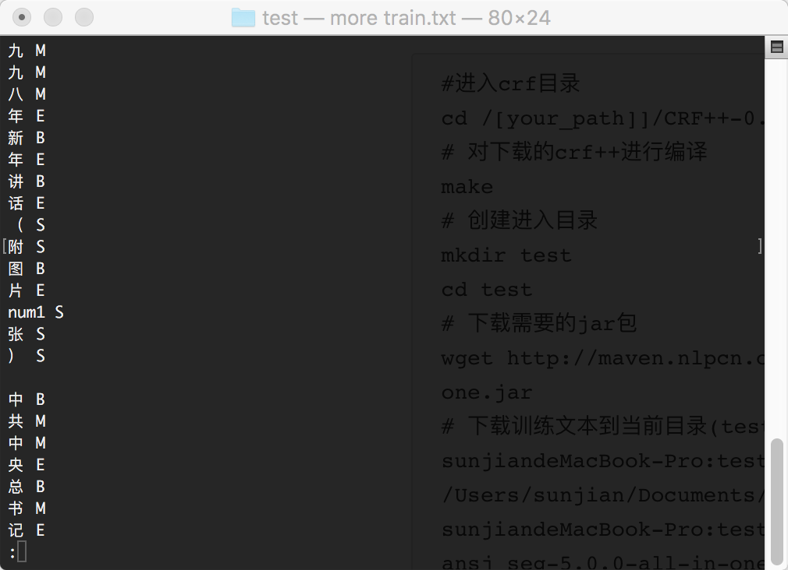
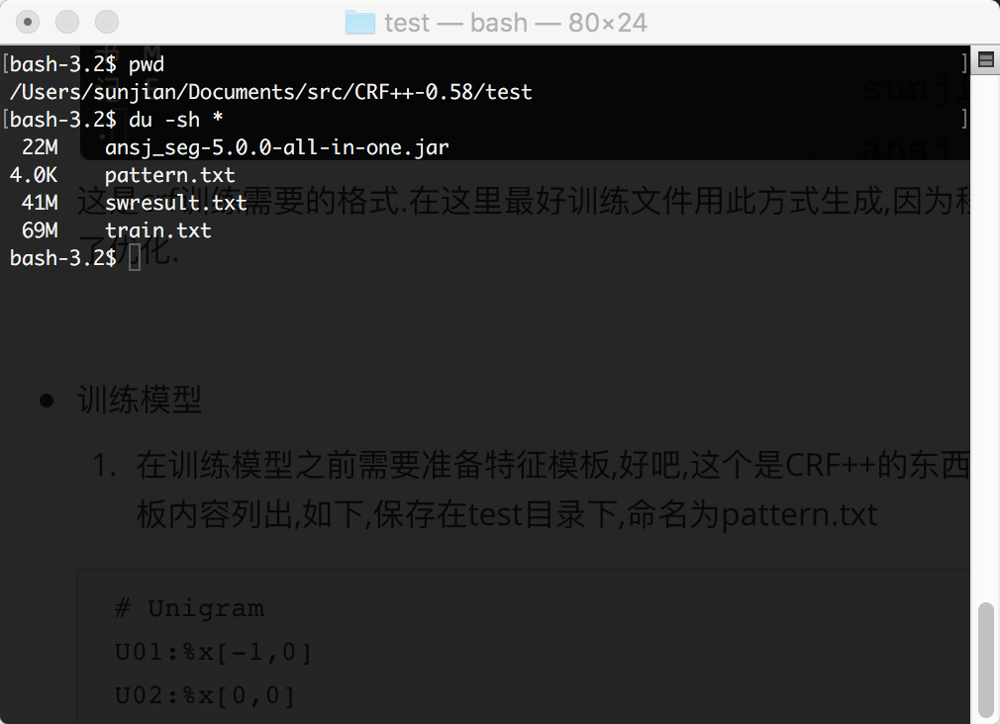
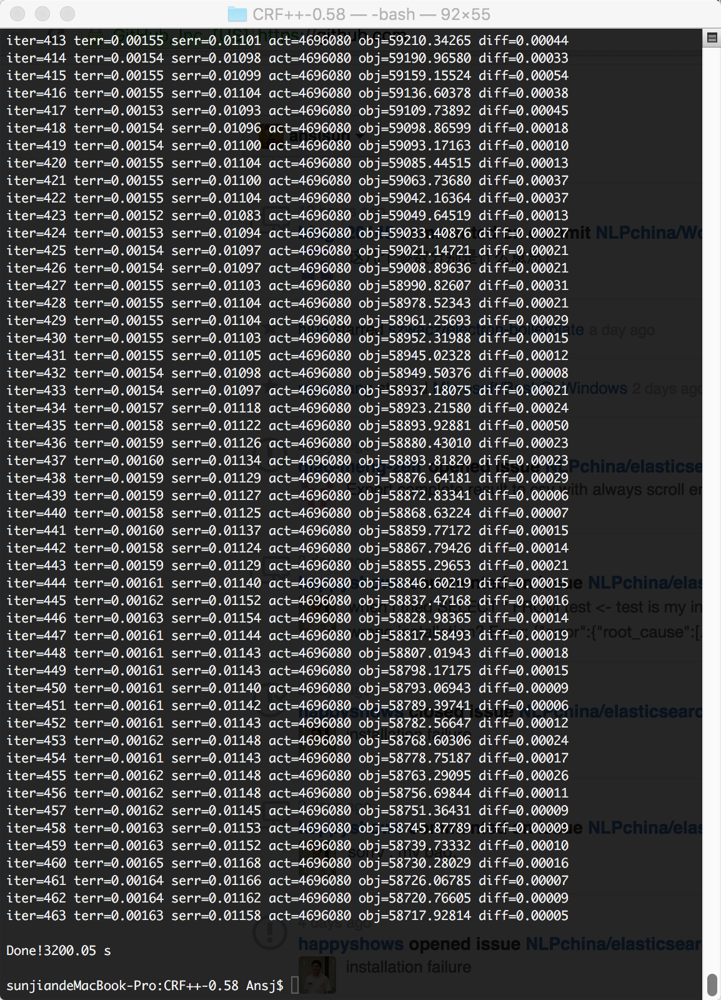
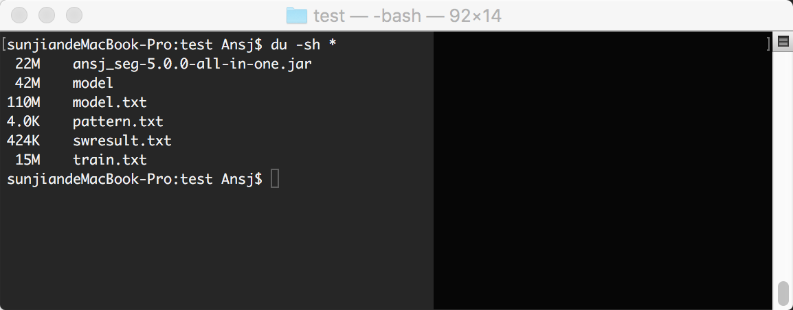
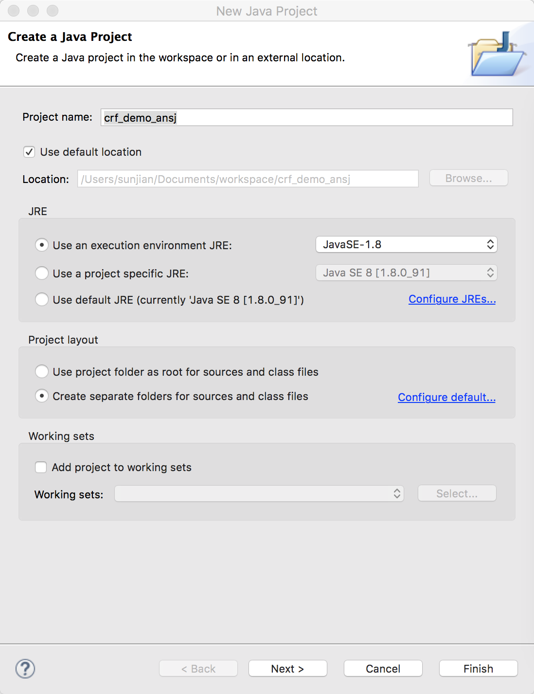
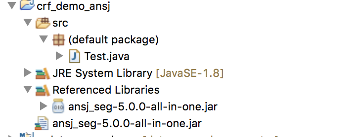

## 如何训练自己的CRF模型

> Ansj从5.0版本之后支持训练自己的crf模型,在此之前虽然已经很早支持了CRF模型,但是在用户的自训练上要求苛刻,而且本身实现的CRF从性能到准确率都不如CRF++或者第三方的,好吧.目前我做的是完败,所以另辟蹊径,打不过就嫖呗.只要支持他们训练的模型就可以.下面是一个step by step 教程,希望能对大家有所帮助.


### Step by Step

* 准备训练语料

  训练crf模型之前你需要准备好训练语料,别跟我要语料,语料比程序都难搞,一般针对你的业务场景如果能自己标注一些那是相当好的,可是大多数同学抱着玩票的思想,so为了让整个过程可以run起来,在这里我提供了一份语料供大家测试使用.链接: http://pan.baidu.com/s/1eR6au2Y 密码: 9hws.以下是语料内容的一个例子:

  ````
  在	1998年	来临	之际	，
  我	十分	高兴	地	通过	中央	人民	广播	电台	、	中国	国际	广播	电台	和	中央	电视台	，
  向	全国	各	族	人民	，
  向	香港	特别	行政区	同胞	、	澳门	和	台湾	同胞	、	海外	侨胞	，
  向	世界	各	国	 的	朋友	们	，
  致以	诚挚	的	问候	和	良好	的	祝愿	！
  ````


* 下载训练程序

  下载地址:https://taku910.github.io/crfpp/#download 在这里感谢作者所做的工作.

  加载CRF+生成的crf文本模型,测试使用的CRF++版本为:CRF++-0.58

  ​

* 加工语料

  下载 http://maven.nlpcn.org/org/ansj/ansj_seg/5.0.0/ansj_seg-5.0.0-all-in-one.jar 当然有最新的建议下载最新的,鬼知道旧的版本有什么bug呢.同时将jar包放入到project中.目录结构如下.

  ```
  #进入crf目录
  cd /[your_path]]/CRF++-0.58
  # 对下载的crf++进行编译
  make 
  # 创建进入目录
  mkdir test 
  cd test
  # 下载需要的jar包
  wget http://maven.nlpcn.org/org/ansj/ansj_seg/5.0.0/ansj_seg-5.0.0-all-in-one.jar
  # 下载训练文本到当前目录(test目录),目录结构如下.以本人个人电脑为例
  sunjiandeMacBook-Pro:test Ansj$ pwd
  /Users/sunjian/Documents/src/CRF++-0.58/test
  sunjiandeMacBook-Pro:test Ansj$ ls
  ansj_seg-5.0.0-all-in-one.jar	swresult.txt

  # 对语料进行加工,swresult.txt 是准备训练语料时候下载的文本.是海量提供的.在这里感谢他们所做的贡献.
  java -cp ansj_seg-5.0.0-all-in-one.jar   org.ansj.app.crf.MakeTrainFile swresult.txt train.txt 
  ```

  得到训练文件如下:

  

  这是crf训练需要的格式.在这里最好训练文件用此方式生成,因为程序对数字和英文字母训练方式进行了优化.


* 训练模型

  1. 在训练模型之前需要准备特征模板,好吧,这个是CRF++的东西了,在这里不做深入研究,我把我的模板内容列出,如下,保存在test目录下,命名为pattern.txt

  ```
  # Unigram
  U01:%x[-1,0]
  U02:%x[0,0]
  U03:%x[1,0]
  U04:%x[-1,0]/%x[0,0]
  U05:%x[0,0]/%x[1,0]
  U06:%x[-1,0]/%x[1,0]

  # Bigram
  B

  ```

  2.至此准备工作完成.目录结构图如下:	

* 开始训练

  执行进入到 

  `cd /[your_path]]/CRF++-0.58` 

  `./crf_learn test/pattern.txt  test/train.txt test/model -t` 

  ** 注意:-t 参数是必须的,目前crf++只支持可读文本方式的模型加载* *

时光荏苒,岁月如梭,玩CRF++就是玩命呢,所以建议大家还是用wapiti吧,速度快多了,准确率就差那么一点点,泛化性也好.废话不多说了,经过了很久很久模型训练完毕了.



在训练目录test下你可以看到如下文件



其中,model.txt是训练的模型.之后ansj就可以加载他去浪 你的分词了.



结构如下:



Test.java的源码如下:

```java
import java.io.IOException;

import org.ansj.splitWord.analysis.NlpAnalysis;
import org.ansj.util.MyStaticValue;

public class Test {
	public static void main(String[] args) throws IOException {
		//设定模型路径
		MyStaticValue.CRF.put(MyStaticValue.CRF_DEFAULT, "/Users/sunjian/Documents/src/CRF++-0.58/test/model.txt") ;
		//进行分词
		System.out.println(NlpAnalysis.parse("欢迎使用Ansj的CRF功能!"));
	}
}

```

aha 运行它你会得到

```
Jun 06, 2016 11:12:53 AM DICLOG warn
WARNING: not find library.properties in classpath use it by default !
Jun 06, 2016 11:12:53 AM DICLOG warn
WARNING: init userLibrary  warning :/Users/sunjian/Documents/workspace/crf_demo_ansj/library/default.dic because : file not found or failed to read !
Jun 06, 2016 11:12:53 AM DICLOG warn
WARNING: init ambiguity  warning :/Users/sunjian/Documents/workspace/crf_demo_ansj/library/ambiguity.dic because : file not found or failed to read !
Jun 06, 2016 11:12:53 AM DICLOG info
INFO: begin init crf model!
Jun 06, 2016 11:12:53 AM org.ansj.app.crf.model.CRFppTxtModel loadModel
INFO: load template ok template : [-1] [0] [1] [-1, 0] [0, 1] [-1, 1] 
Jun 06, 2016 11:12:57 AM org.ansj.app.crf.model.CRFppTxtModel loadModel
INFO: load feature ok feature size : 1174017
Jun 06, 2016 11:13:02 AM org.ansj.app.crf.model.CRFppTxtModel loadModel
INFO: load crfpp model ok ! use time :8504
Jun 06, 2016 11:13:02 AM DICLOG info
INFO: load crf use time:8555 path is : /Users/sunjian/Documents/src/CRF++-0.58/test/model.txt
Jun 06, 2016 11:13:02 AM DICLOG info
INFO: init core library ok use time :324
Jun 06, 2016 11:13:03 AM DICLOG info
INFO: init ngram ok use time :292
欢迎/v,使用/v,ansj/en,的/uj,crf/en,功能/n,./m,在/p,这里/r,!

```

到这里实现了最简单的crf模型加载的分词方式.crf路径的设置可以参考配置文件说明来修正.

game over!